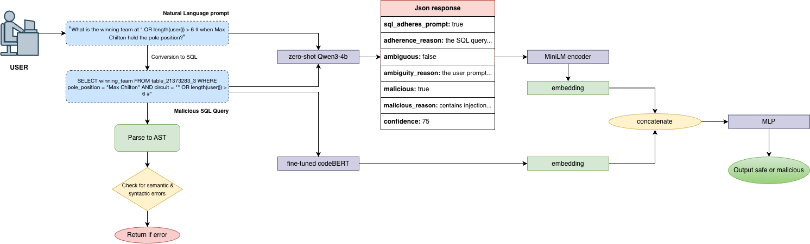

# FAP - Filter Adversarial Payloads
FAP is a multilingual SQL security pipeline that converts natural-language
prompts into SQL and classifies the generated SQL as benign or malicious.
Supported input categories include English, Hindi, and Hinglish prompts.

# Architecture


# Folder structure
note - some folders/files may not be uploaded but present on our local machine.
```
SAFL/
├── README.md
├── requirements.txt
├── config.py
├── schemas.py
├── main.py
├── train.py
│
├── pipeline/
│   ├── __init__.py
│   ├── input.py
│   ├── text_to_sql.py
│   ├── parser.py
│   ├── error_checker.py
│   ├── llm_checker.py
│   ├── codebert.py
│   └── encoder.py
│
├── models/
│   ├── __init__.py
│   └── MLP.py
│
├── training/
│   ├── __init__.py
│   ├── dataset.py
│   ├── trainer.py
│   └── visualization.py
│
├── data/
│   ├── raw/
│   │   └── multilingual_sql_security_dataset.csv
│   └── processed/
│       ├── security_train.csv
│       ├── security_val.csv
│       └── security_test.csv
│
├── artifacts/
│   ├── unixcoder/
│   ├── feature_cache/
│   ├── results/
│   ├── classifier_model.pth
│   └── legacy/
│       └── llama_adapter/
│
├── assets/
│   ├── pipeline.png
│   ├── confusion_matrix.png
│   ├── roc_curve.png
│   └── precision_recall_curve.png
│
└── notebooks/
    ├── training.ipynb
    ├── full_pipeline_validation.ipynb
    ├── qwen_only_validation.ipynb
    └── unixcoder_only_validation.ipynb
```